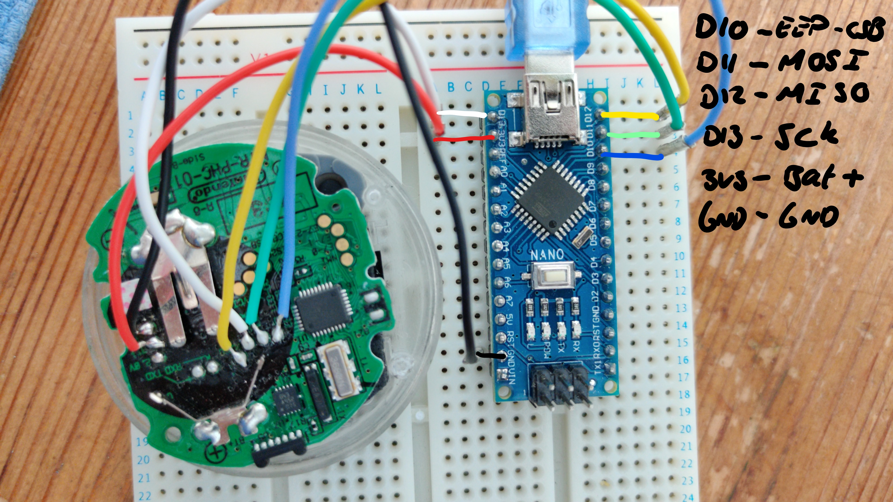

# Info on the ROM dump

## Dumping
64K ROM dumped with an arduino nano and wires soldered to the test pads.
Arduino reads the data then echoes it back through serial monitor.
Code has been modified from the arduino sketch at [andre-richter/arduino-spi-dump-eeprom](https://github.com/andre-richter/arduino-spi-dump-eeprom).

There was trouble initially getting it working but adding a delay of 5ms between each read seems to work fine and get consistent reads.

For wiring to the pokewalker board:


For breakout on the arduino:


There are two ROMS.
The ROM that has a dump is the external 64K ROM which contains the graphics data.
The internal 48K ROM will be harder to dump.

## Info on the ROMs

Thanks to `u/WarrantyVoider` for all the help on this.
The 64k dump does not contain any code, but rather all of the image data on the walker.

The images are stored as 1-bit greyscale images, each 8 pixels wide.
The images are then presumably overlapped to give the 3-colour and 1-alpha channel images as seen on the walker.
This process is likely similar to the way that character sprites are rendered in the original gen 1 games.

Some interesting notes:
All of the menu titles and icons are stored as images, not text overlayed onto backgrounds.
As seen in the `dumps/img/` directory (`-w16.png`), the images contain writing as pictures.
The player name is also stored as an image as well (`Callum` here).
This would mean that the game cart probably generates this image and then sends it over to the walker when first registered.

The first 8 bytes on the 64K ROM is the string `nintendo`.
This is what initially told me that the ROM dump had worked.


## Objdump tools
For converting between hex and binary: 
```
xxd -r -p $file_name.txt $file_name.bin
```
There is a script `to-bin.sh` that converts all `.txt` files into `.bin` files in the `dumps/` directory.

For generating the images, there is a python file to do that.
Feel free to modify and play with widths/bit patterns etc.

On Ubuntu, the package that can be used to diassemble and gain strings is `binutils-h8300-hms`.
To get an assembly output, use
```
h8300-hms-objdump -m h8300 -b binary -D $file_name.bin > $file_name.S
```


